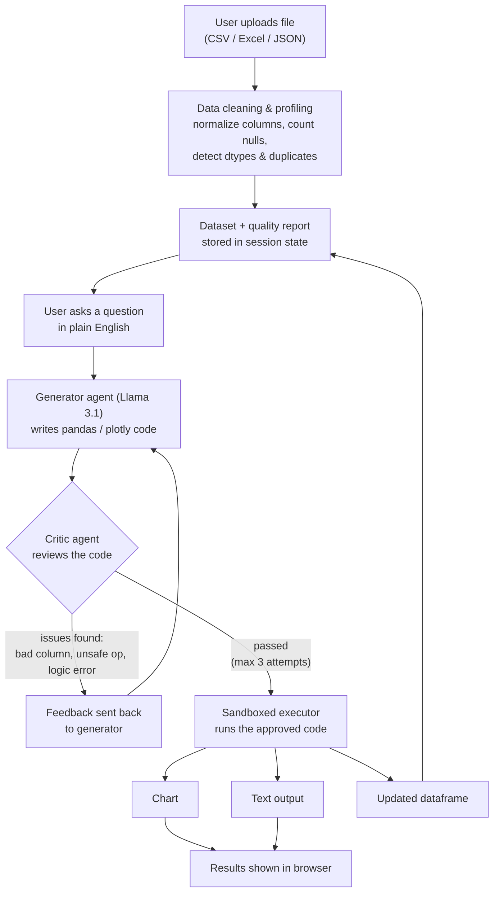

# Smart Data Analyst

Upload a spreadsheet, ask a question in plain English, and get back a chart, an answer, or a cleaned dataset. Under the hood, a small pipeline of two LLM agents writes the analysis code, checks it for mistakes, and only then runs it.

## What it does

- Upload a CSV, Excel, or JSON file
- The data gets cleaned and profiled automatically: column names normalized, nulls counted, duplicates flagged, types detected
- Ask questions like "show sales by region" or "remove duplicate rows"
- A Generator agent writes the pandas/plotly code to answer the question
- A Critic agent checks that code before it runs — wrong column names, bad filters, unsafe operations get caught and sent back for a rewrite (up to 3 tries)
- Results come back as a chart, text output, or an updated table

## How it works

The core of the app is a generate-critique-execute loop. Rather than trusting the first thing the model writes, a second model reviews it before it touches your data.



Step by step:

1. **Upload** — the file is parsed with pandas and cleaned immediately: column names lowercased and trimmed, duplicates counted, nulls quantified per column.
2. **Ask** — type a question, e.g. "plot revenue by month."
3. **Generate** — the Generator agent (Llama-3.1-8B-Instruct via Hugging Face Inference) gets your question plus the dataset's schema and health metrics, and writes code to answer it.
4. **Critique** — before that code runs, the Critic agent checks it: correct column names, sensible string matching, nothing malicious. If it's not right, it explains what's wrong.
5. **Retry** — the Generator gets that feedback and rewrites the code. Repeats up to 3 times until the Critic passes it.
6. **Execute** — the approved code runs in a restricted namespace with only pandas, numpy, plotly.express, and matplotlib.pyplot available — no filesystem or OS access.
7. **Respond** — the resulting chart, text, or modified dataframe is sent back to the UI. If the data changed, it's re-profiled for the next question.

## Tech stack

| Layer | Technology |
|---|---|
| Backend | FastAPI + Uvicorn |
| Data processing | pandas, numpy |
| AI agents | Hugging Face `InferenceClient`, `meta-llama/Llama-3.1-8B-Instruct` |
| Visualization | Plotly, Matplotlib |
| Templating | Jinja2 |
| Frontend | HTML/CSS/JS (`templates/`, `static/`) |

## Getting started

### Prerequisites

- Python 3.10+
- A Hugging Face access token with inference permissions

### Installation

```bash
git clone https://github.com/rida7-crypto/smart-data-analyst.git
cd smart-data-analyst

python -m venv venv
source venv/bin/activate   # On Windows: venv\Scripts\activate

pip install -r requirements.txt
```

### Configuration

Create a `.env` file in the project root:

```env
HUGGINGFACE_TOKEN=your_hugging_face_token_here
```

### Run

```bash
uvicorn main:app --reload
```

Open http://127.0.0.1:8000, upload a dataset, and start asking questions.

## API reference

| Method | Endpoint | Description |
|---|---|---|
| GET | `/` | Renders the main web UI |
| POST | `/upload` | Accepts a file upload, cleans it, returns a data quality report |
| POST | `/analyze` | Accepts a natural-language query, runs it through the generate-critique-execute pipeline, returns results |

Example `/analyze` response:

```json
{
  "status": "Success",
  "iterations": 2,
  "code_run": "fig = px.bar(df, x='region', y='sales')",
  "has_chart": true,
  "chart_data": "{ ...plotly json... }",
  "output_text": "",
  "metrics": { "shape": [500, 8], "total_nulls": 3 },
  "data_preview": [ { "region": "West", "sales": 12000 } ]
}
```

## Project structure

```
smart-data-analyst/
├── main.py               # FastAPI app & routes (/, /upload, /analyze)
├── analyst_backend.py    # Cleaning logic, Generator agent, Critic agent, sandboxed executor
├── requirements.txt
├── templates/             # Jinja2 HTML templates
├── static/                 # CSS / JS / assets
└── .gitignore
```

## Why the critic step matters

Since the generated code runs against real data, there's a review step built in before anything executes:

- The Critic agent checks for malicious patterns (`os.system`, blind `eval`, file deletion) before code is approved.
- Execution happens in a restricted namespace — only pandas, numpy, plotly.express, and matplotlib.pyplot are exposed.
- Up to 3 correction rounds catch logic errors (wrong column names, bad filters) before they quietly produce a wrong answer.

## Contributing

Issues and pull requests are welcome. If you find a bug in the agent prompts, the cleaning logic, or the UI, open an issue.

## License

MIT — see [LICENSE](LICENSE).
